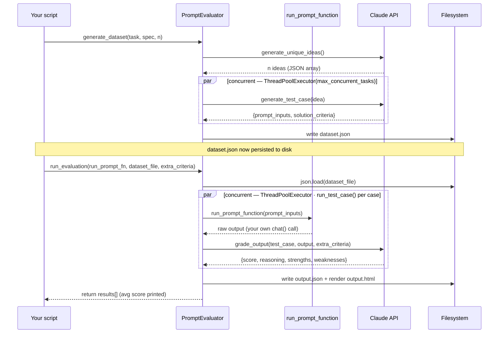

# PromptEvaluator — Developer Guide

A reusable harness for testing prompts at scale: it invents realistic test cases for your task, runs your prompt against each one, and has Claude grade the results 1–10 with reasoning. Drop it into any script that needs to answer "is this prompt actually good?"

Paired example: [`05_prompt_engineering_excercise.py`](../05_prompt_engineering_excercise.py)

## What it solves

Hand-testing a prompt — trying a few inputs and eyeballing the output — doesn't scale and misses edge cases. `PromptEvaluator` automates both halves of that work:

- **Generation** — Claude invents a diverse set of test cases for your task.
- **Grading** — Claude scores your prompt's output against criteria written for each case.

It never calls your prompt itself. You hand it one function — `run_prompt_function(prompt_inputs) -> str` — and it drives that function for every test case, grades what comes back, and writes a scored HTML report.

## Quick start

The pattern used in `05_prompt_engineering_excercise.py`, generalized — this is all any script needs:

```python
from building_with_claude_api.utils.prompt_evaluator import PromptEvaluator
from building_with_claude_api.utils.llm_messages import add_user_message, chat

# 1. wrap your prompt in a function that returns raw model text
def run_prompt(prompt_inputs):
    messages = []
    add_user_message(messages, f"...your template using {prompt_inputs['key']}...")
    return chat(messages)

# 2. build a dataset of test cases once
evaluator = PromptEvaluator(max_concurrent_tasks=3)
evaluator.generate_dataset(
    task_description="one sentence describing the task",
    prompt_inputs_spec={"key": "what this input means"},
    num_cases=5,
    output_file="dataset.json",
)

# 3. grade your prompt against that dataset
evaluator.run_evaluation(
    run_prompt_function=run_prompt,
    dataset_file="dataset.json",
    extra_criteria="non-negotiable requirements, if any",
)
```

Open `output.html` for the scored, human-readable report — `output.json` carries the same results as data.

## How it works

Two calls, two phases. `generate_dataset` talks only to Claude and produces a file; `run_evaluation` reads that file back and is the only place your own `run_prompt_function` gets invoked.



*Figure 1.* Solid arrows are calls, dashed arrows are returns. The two `par` blocks are where `ThreadPoolExecutor` fans work out across up to `max_concurrent_tasks` workers — everything else happens once, in order.

## Data flow

The same run, viewed as shapes instead of calls — what each stage receives and hands off.

```mermaid
flowchart LR
    subgraph Build["Building the dataset · generate_dataset()"]
        A["task_description +\nprompt_inputs_spec"] -->|generate_unique_ideas| B["ideas\nstring[] × n"]
        B -->|"generate_test_case()\n× n, parallel"| C["test_case {\nprompt_inputs,\nsolution_criteria }"]
        C -->|"collect + json.dump"| D[("dataset.json")]
    end

    subgraph Evaluate["Evaluating each case · run_evaluation()"]
        E["dataset.json\n(loaded)"] -->|run_prompt_function| F["output\nstr"]
        F -->|grade_output| G["grade {\nscore, reasoning,\nstrengths/weaknesses }"]
        G -->|"aggregate + report"| H[("output.json +\noutput.html")]
    end

    D -.->|"run_evaluation(dataset_file=...)"| E
```



*Figure 2.* The two `dataset.json` nodes are the same file, written once then reloaded; the final node is the report. Everything between is held in memory only for the duration of one run.

## Method reference

| Method | Returns | Purpose |
|---|---|---|
| `__init__(self, max_concurrent_tasks=3)` | — | Sets how many test cases run in parallel via `ThreadPoolExecutor`. Raise it for speed once you trust your rate limit; drop it to `1` if you see rate-limit errors. |
| `generate_unique_ideas(task_description, prompt_inputs_spec, num_cases)` | `list[str]` | Asks Claude for `num_cases` distinct testing scenarios for the task — one short sentence per idea. |
| `generate_test_case(task_description, idea, prompt_inputs_spec)` | `dict` | Expands one idea into a concrete case: `prompt_inputs` plus 1–4 `solution_criteria`. Stamps `task_description` and `scenario` onto the result. |
| `generate_dataset(task_description, prompt_inputs_spec, num_cases=1, output_file="dataset.json")` | `list[dict]` | **The call you make to build a dataset.** Runs the two methods above — ideas first, then one concurrent `generate_test_case` per idea — and writes the full list to `output_file`. |
| `grade_output(test_case, output, extra_criteria)` | `dict` | Scores `output` against the case's `solution_criteria`, returning `{strengths, weaknesses, reasoning, score}`. Any violation of `extra_criteria` caps the score at 3. |
| `run_test_case(test_case, run_prompt_function, extra_criteria=None)` | `dict` | Calls `run_prompt_function(test_case["prompt_inputs"])`, then grades the result. One test case, start to finish. |
| `run_evaluation(run_prompt_function, dataset_file, extra_criteria=None, json_output_file="output.json", html_output_file="output.html")` | `list[dict]` | **The call you make to score a prompt.** Loads `dataset_file`, runs `run_test_case` concurrently over every entry, prints the average score, and writes both output files. |

## Reusing this in a new script

1. **Write `run_prompt(prompt_inputs)`.** Build your prompt from the dict's keys and return `chat()`'s raw text. This is the only prompt-specific code you write — everything else is generic.
2. **Describe the task once.** A one-sentence `task_description` and a `prompt_inputs_spec` dict mapping each input key to a one-line meaning. Claude uses these to invent realistic cases.
3. **Generate a dataset.** Call `generate_dataset(...)`. Keep `num_cases` low (3–5) while iterating — each idea costs a full `generate_test_case` round trip.
4. **Evaluate.** Call `run_evaluation(run_prompt_function=run_prompt, dataset_file="dataset.json", extra_criteria="...")`. Reuse the same `dataset.json` across prompt revisions so scores stay comparable.
5. **Read `output.html`.** Per-case scenario, output, strengths, and weaknesses — the fastest way to see exactly where a prompt is weak.

## Notes & gotchas

- **Concurrency spends real API calls.** `max_concurrent_tasks` fans work out across threads, not a queue — each worker is a live request. Start at 1–2 on a lower rate-limit tier.
- **`chat()` hardcodes `max_tokens=1000`** (in `llm_messages.py`) — which is why the dataset prompts explicitly ask Claude for ideas "solvable with no more than 400 tokens of output." Keep your own `run_prompt` outputs inside that budget too, or raise `max_tokens` at the source.
- **One dataset, many runs.** `run_evaluation` takes a `dataset_file`, not an in-memory list — save `dataset.json` once per task and re-run evaluation against it as the prompt changes, so scores stay comparable revision to revision.
- **Grading criteria are model-written.** `generate_test_case` asks Claude to invent its own `solution_criteria` per case. Skim `dataset.json` once after generating — one unreasonable criterion will silently cap every score against it.
- **`render()` only understands single braces.** `{key}` is replaced from `variables`; a literal brace in a template must be doubled (`{{` / `}}`) or it's read as a placeholder.
