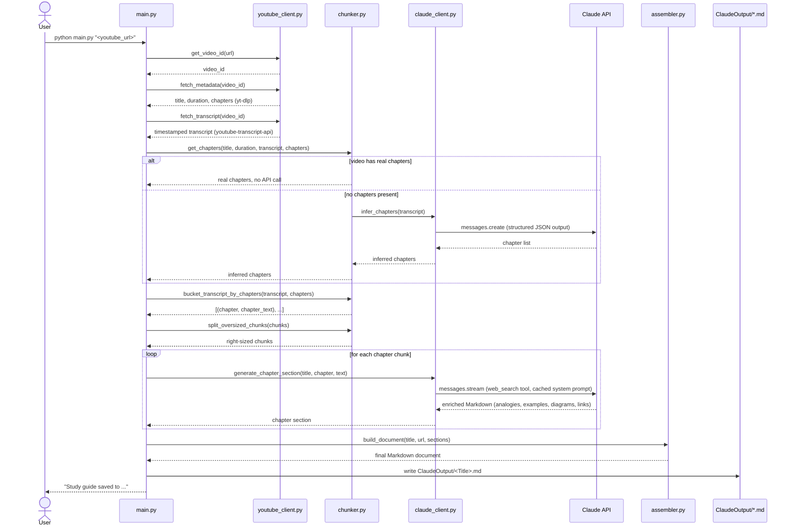

# YouTube Transcript → Claude-Enriched Study Notes

Turn any YouTube video into a beginner-friendly Markdown study guide. Give it a
video URL; it fetches the transcript, splits it into chapters, and asks
Claude to rewrite each chapter as clear study notes — with plain-language
explanations, analogies, worked examples, Mermaid diagrams, and real cited
reference links (via Claude's web search tool). Works for anything from a
few-minute clip up to ~20-hour videos.

## What it does, end to end

1. **Fetch metadata** — video title, duration, and creator-provided chapter
   markers, via `yt-dlp`.
2. **Fetch transcript** — the full timestamped transcript, via
   `youtube-transcript-api`.
3. **Determine chapters** — if the video has real chapters, use them. If not,
   send the transcript to Claude once and ask it to propose sensible chapter
   boundaries.
4. **Chunk by chapter** — bucket transcript text into each chapter; any single
   chapter whose text is too large for one call gets sub-split automatically.
5. **Generate each chapter's notes** — one Claude API call per chapter
   (streamed, with the `web_search` tool enabled so reference links are real,
   not invented), producing enriched Markdown for that chapter.
6. **Assemble the document** — title, video link, a table of contents, then
   every chapter's generated section in order.
7. **Write the file** — saved to `ClaudeOutput/<Video Title>.md` in this repo.

## Architecture



### Module map

| File | Responsibility |
|---|---|
| [`config.py`](config.py) | All non-secret settings: model name, effort level, token/chunking thresholds, output folder name. Loads `ANTHROPIC_API_KEY` from `.env`. |
| [`prompts.py`](prompts.py) | Every prompt sent to Claude, as plain string constants — no prompt text lives inside pipeline logic. |
| [`youtube_client.py`](youtube_client.py) | URL/ID parsing, `yt-dlp` metadata fetch, `youtube-transcript-api` transcript fetch. |
| [`chunker.py`](chunker.py) | Chapter detection (real or Claude-inferred), bucketing the transcript by chapter, splitting oversized chapters. |
| [`claude_client.py`](claude_client.py) | The only file that talks to the Anthropic API. Chapter inference call + per-chapter generation call (with retry on transient network errors). |
| [`assembler.py`](assembler.py) | Pure Markdown templating — title, video link, table of contents, chapter bodies. No API calls, fully deterministic and easy to unit test. |
| [`main.py`](main.py) | CLI entry point that wires all of the above together. |

### Key design decisions

- **Chunk by chapter, not by token budget.** Even though Claude Sonnet 4.6
  has a 1M-token context window (large enough to fit a 20-hour transcript in
  one call), each chapter is generated with its own API call. This keeps
  every call fast and focused, means a single failure only costs one
  chapter's retry (not the whole video), and avoids quality loss from
  cramming a huge transcript into one generation pass.
- **Real chapters first, Claude-inferred as fallback.** YouTube chapter
  markers (when the creator added them) are the ground truth for how the
  video is structured. Claude is only asked to invent chapter boundaries
  when none exist.
- **Diagrams as Mermaid code, not images.** Visual aids are generated as
  fenced ` ```mermaid ` blocks instead of fetched/generated images. This
  avoids copyright and broken-link risk entirely, renders natively in
  GitHub/Obsidian/VS Code, and is simple and fully testable — no image
  pipeline needed.
- **Real reference links via the `web_search` tool.** Claude's server-side
  `web_search` tool is enabled during chapter generation specifically so
  "Further Reading" links are genuine search results, never hallucinated
  URLs.
- **Prompt caching on the system prompt.** The chapter-generation system
  prompt is identical across every chapter call in a run, so it's marked
  with `cache_control` — later chapters read it from cache instead of paying
  full price again.
- **Resilience per chapter, not per run.** Transient network errors during a
  chapter's streamed generation are retried automatically (exponential
  backoff); if a chapter still fails after retries, it's skipped with a
  logged warning so a 20-hour video's whole run isn't lost over one flaky
  chapter.

## Setup

### 1. Create a virtual environment and install dependencies

```bash
cd Youtube_Transcript_Fetcher
python3 -m venv .venv
source .venv/bin/activate      # Windows: .venv\Scripts\activate
pip install -r requirements.txt
```

A dedicated virtualenv is recommended (rather than the monorepo's shared
one) because this tool needs a newer `anthropic` SDK version than what's
pinned at the repo root.

### 2. Configure your API key

```bash
cp .env.example .env
```

Then edit `.env` and set your key:

```
ANTHROPIC_API_KEY=sk-ant-...
```

`.env` is already covered by the repo's `.gitignore` — it will not be
committed.

### 3. (Optional) Tune the model/config

Everything tunable lives in [`config.py`](config.py) — no need to touch
pipeline code to change:

| Setting | Default | What it controls |
|---|---|---|
| `MODEL` | `claude-sonnet-4-6` | Which Claude model generates the notes. |
| `EFFORT` | `medium` | Claude's thinking/effort depth (`low`/`medium`/`high`/`max`) — higher costs more but can improve quality. |
| `CHAPTER_GENERATION_MAX_TOKENS` | `8000` | Max output tokens per chapter's generated section. |
| `MAX_CHAPTER_TOKENS` | `50000` | Token threshold above which a single chapter's transcript gets sub-split before generation. |
| `MIN_CHARS_FOR_CHAPTER_INFERENCE` | `2000` | Below this transcript length, skip chapter inference entirely and treat the whole video as one chapter. |
| `OUTPUT_DIR_NAME` | `ClaudeOutput` | Output folder name (created in this directory). |

## Usage

```bash
source .venv/bin/activate
python main.py "https://www.youtube.com/watch?v=VIDEO_ID"
```

Also accepts `youtu.be` links, `/embed/` and `/shorts/` links, or a bare
11-character video ID:

```bash
python main.py "https://youtu.be/VIDEO_ID"
python main.py VIDEO_ID
```

Progress is printed per chapter as it's generated:

```
Fetching metadata for https://www.youtube.com/watch?v=VIDEO_ID ...
Fetching transcript for 'Some Video Title' ...
Determining chapters ...
Found 6 chapter(s).
Generating section 1/6: Introduction
Generating section 2/6: Core Concepts
...
Study guide saved to ClaudeOutput/Some Video Title.md
```

The output file is named after the video title (sanitized for filesystem
safety) and includes the source video URL, so you always know where it came
from.

## Testing

```bash
source .venv/bin/activate
python -m pytest tests/ -v
```

All tests mock the YouTube and Anthropic API calls — no network access or
API key required to run them. Tests cover URL/ID parsing edge cases, chapter
detection and bucketing logic, oversized-chapter splitting, Markdown
assembly, and the network-error retry behavior.

## Troubleshooting

- **`yt-dlp` errors like "The page needs to be reloaded"** — YouTube changes
  frequently break older `yt-dlp` releases. Run
  `pip install --upgrade yt-dlp` inside the virtualenv.
- **A chapter is skipped with a network error** — the pipeline retries
  transient network failures automatically per chapter; if a chapter still
  fails after retries, it's logged and skipped rather than aborting the
  whole run. Re-run the tool if too many chapters were skipped.
- **No transcript available** — some videos have transcripts disabled or
  unavailable; this surfaces as a clear `Error: ...` message rather than a
  stack trace.
